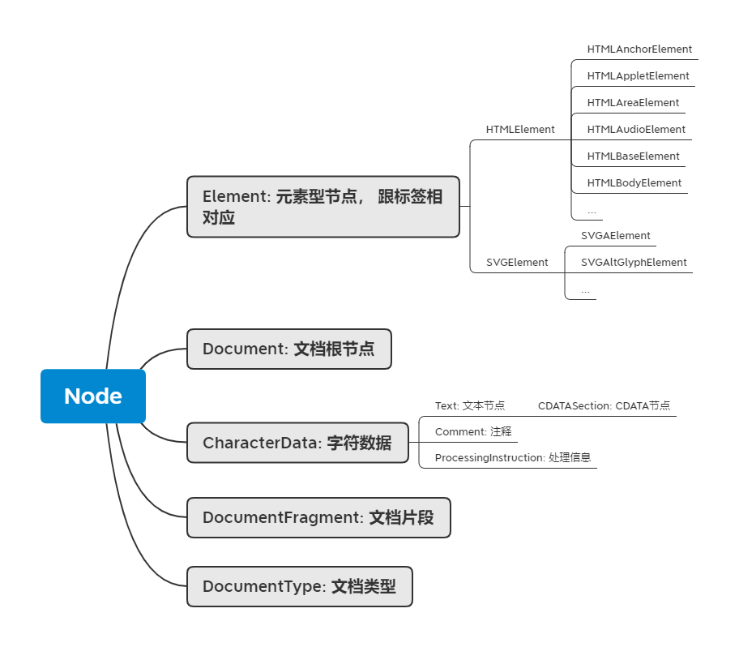

# Revisiting HTML
## 1. HTML Definition
### 1.1 Superset of HTML (before HTML5)
- XML
- SGML
### 1.2 DTD and HTML namespace
#### 1.2.1 DTD - HTML entities
- nbsp - no-break space
- quot - “”
- amp - &
- lt - <
- gt - >
- apos - '
#### 1.2.2 HTML namespaces
- HTML (XHTML)
- SVG
- MathML
## 2. HTML Markup
- aside
- main (only 1 per page)
- article
- hgroup, h1, h2...
- p (if no markup available, use class)
- strong and em
- ul, ol, li
- figure, img, figurecaption
- dfn (definition)
- nav (navigation)
- pre, samp (example), code
- footer
## 3. HTML Syntax
- legal elements: 
    - Element `<tagname></tagname>`
    - Text: text
    - Comment: `<!-- comments -->`
    - DocumentType: `<!Doctype html>`
    - ProcessingInstruction: `<?a 1?>`
    - CDATA: `<![CDATA[]]>` like text node
- characters and special characters
## 4. Browser API | DOM API
- DOM is NOT the only browser API
### 4.1 Node

### 4.2 Working with Elements
#### 4.2.1 Navigation
- Node navigation
    - parentNode
    - childNodes
    - firstChild
    - lastChild
    - nextSibling
    - previousSibling
- Element navigation
    - parentElement
    - children
    - firstElementChild
    - lastElementChild
    - nextElementSibling
    - previousElementSibling
#### 4.2.2 Manipulation
- appendChild
- insertBefore
- removeChild
- replaceChild (=remove + insert)

#### 4.2.3 Advanced operations
- compareDocumentPosition
- contains
- isEqualNode
- isSameNode (equivalent to "===")
- cloneNode (deep copy if set parameter to true)

## 5. Browser API | DOM API | Event API
### 5.1 addEventLister
- target.addEventListener(type, listener, [, options])
    - options: capture (capture/bubbling)
    ```html
    <div id="a" style="width: 100%; height: 300px;background: lightblue;">
    <div id="b" style="width: 100%; height: 200px; background: pink;">
    </div>
    </div>

    <script>
        var a = document.getElementById("a");
        var b = document.getElementById("b");
    </script>
    ```
    - options: once
    - options: passive
## 6. Browser API | DOM API | Range API
### 6.1 Create a range
```javaScript
var range = new Range()
range.setStart(element, 9) // element and displacement
range.setEnd(element, 4)
var range = document.getSelection().getRangeAt(0);
```
### 6.2 Other Range API functions
- range.setStartBefore
- range.setEndBefore
- range.setStartAfter
- range.setEndAfter
- range.selectNode
- range.selectNodeContents
```javaScript
var fragment = range.extractContents()
range.insertnode(document.createTextNode("aaaa"))
```

## 7. Browser API | CSSOM
- DOM API - Abstraction of HTML
- CSSOM - Abstraction of CSS
### 7.1 Rules
```javaScript
document.styleSheets[0].cssRules
document.styleSheets[0].insertRule("p {color:pink;}", 0) //parameters: rule, position
document.styleSheets[0].removeRule(0)
```
Pseudo elements sytles have to be changed through CSSOM
e.g.
```html
<style title="Hello">
    a::before{
        color:red;
        content:"Hello"
    }
</style>
<link rel="stylesheet" title="x" href="data:text/css,p%7Bcolor:blue%7D"/>
<a> world</a>
```
We can change the "before" pseudo element color to green
```javaScript
document.styleSheets[0].cssRules[0].style.color = "lightgreen"
```
### 7.2 getComputedStyle
```javaScript
window.getComputedStyle(elt, pseudoElt)
```
- elt - elements we want 
- pseudoElt - pseudo element (optional)

e.g.
```javaScript
getComputedStyle(document.querySelector("a")); //element
getComputedStyle(document.querySelector("a"), "::before") //pseudo element
getComputedStyle(document.querySelector("a"), "::before").color //access property of pseudo element
```
## 8. Browser API | CSSOM View
- Get properties after rendering
### 8.1 Window API
- window.innerHeight, window.innerWidth
- window.outerHeight, window.outerHeight 
- window.devicePixelRatio (DPR. Normal: 1:1 Retina Screen: 1:2)
- window.screen
    -window.screen.width
    -window.screen.height
    -window.screen.availWidth
    -window.screen.availHeight
-window.open
-window.moveTo(x,y)
-window.moveBy(x,y)
-window.resizeTo(x,y)
-window.resizeBy(x,y)
-scroll
-window.scroll
-layout
    -getClientRects()
    -getBoundingClentRect()
## 9. Browser API | Other APIs
### 9.1 Standards
- khronos
    - WebGL
- ECMA
    - ECMAScript
- WHATWG
    - HTML
- W3C
    - webaudio
    - CG/WG

### Homework (whatwg part only)
```javaScript
//https://html.spec.watwg.org/#window

    {
        let names = Object.getOwnPropertyNames(window);
        let js = new Set();
        let objects = ["BigInt", "BigInt64Array", "BigUnit64Array", "Infinity", "NaN", "undefind", "eval", "isFinite", "isNaN", "parseFloat", "parseInt", "decodeURI", "decodeURIComponent", "encodeURI", "encodeURIComponent", "Array", "Date", "RegExp", "Promise", "Proxy", "Map", "WeakMap", "Set", "WeakSet", "Function", "Boolean", "String", "Number", "Symbol", "Object", "Error", "EvalError", "RangeError", "ReferenceError", "SyntaxError", "TypeError", "URIError", "ArrayBuffer", "SharedArrayBuffer", "DataView", "Float32Array", "Float64Array", "Int8Array", "Int16Array", "Int32Array", "Uint8Array", "Uint16Array", "Uint32Array", "Uint8ClampedArray", "Atomics", "JSON", "Math", "Reflect", "escape", "unescape"];
    
        objects.forEach(o=>js.add(o));

        names = names.filter(e=>!js.has(e));

        names = names.filter(e=>{
            try{
                return !(window[e].prototype instanceof Node);
            } catch(err){
                return true;
            }
        }).filter(e=>e!="Node")

        let windowprops = new Set();
        objects = ["window", "self", "document", "name", "location", "history", "customElements", "locationbar", "menubar"," personalbar", "scrollbars", "statusbar", "toolbar", "status", "close", "closed", "stop", "focus", " blur", "frames", "length", "top", "opener", "parent", "frameElement", "open", "navigator", "applicationCache", "alert", "confirm", "prompt", "print", "postMessage", "console"];
   
        objects.forEach(o => windowprops.add(o));
        names = names.filter(e=>!windowprops.has(e));
    }

    //https://html.spec.whatwg.org/

    {
        let interfaces = new Set();
        objects = ["ApplicationCache", "AudioTrack", "AudioTrackList", "BarProp", "BeforeUnloadEvent", "BroadcastChannel", "CanvasGradient", "CanvasPattern", "CanvasRenderingContext2D", "CloseEvent", "CustomElementRegistry", "DOMStringList", "DOMStringMap", "DataTransfer", "DataTransferItem", "DataTransferItemList", "DedicatedWorkerGlobalScope", "Document", "DragEvent", "ErrorEvent", "EventSource", "External", "FormDataEvent", "HTMLAllCollection", "HashChangeEvent", "History", "ImageBitmap", "ImageBitmapRenderingContext", "ImageData", "Location", "MediaError", "MessageChannel", "MessageEvent", "MessagePort", "MimeType", "MimeTypeArray", "Navigator", "OffscreenCanvas", "OffscreenCanvasRenderingContext2D", "PageTransitionEvent", "Path2D", "Plugin", "PluginArray", "PopStateEvent", "PromiseRejectionEvent", "RadioNodeList", "SharedWorker", "SharedWorkerGlobalScope", "Storage", "StorageEvent", "TextMetrics", "TextTrack", "TextTrackCue", "TextTrackCueList", "TextTrackList", "TimeRanges", "TrackEvent", "ValidityState", "VideoTrack", "VideoTrackList", "WebSocket", "Window", "Worker", "WorkerGlobalScope", "WorkerLocation", "WorkerNavigator"];
        objects.forEach(o=>interfaces.add(o));
        names = names.filter(e=>!interfaces.has(e));
    }

    //https://streams.spec.whatwg.org/#blqs-class

    names = filterOut(names, ["ReadableStream", "ReadableStreamDefaultReader", "ReadableStreamBYOBReader", "ReadableStreamDefaultController", "ReadableByteStreamController", "ReadableStreamBYOBRequest", "WritableStream", "WritableStreamDefaultWriter", "WritableStreamDefaultController", "TransformStream", "TransformStreamDefaultController", "ByteLengthQueuingStrategy", "CountQueuingStrategy"]);

    //https://encoding.spec.whatwg.org/#dom-textencoder

    names = filterOut(names, ["TextDecoder", "TextEncoder", "TextDecoderStream", "TextEncoderStream"]);


```

